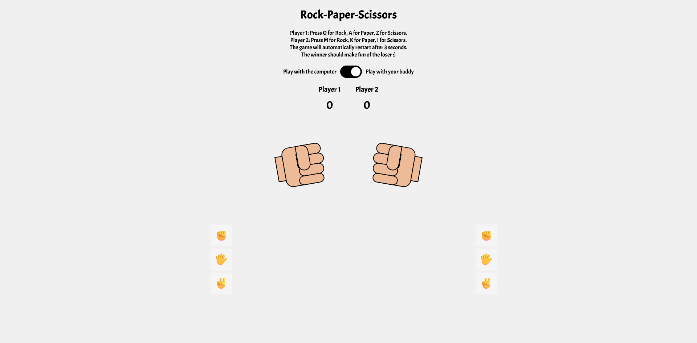

# Rock Paper Scissors Game

A fun, interactive rock-paper-scissors game with both single-player and two-player modes. Built with vanilla JavaScript, HTML, and CSS.

## Features

- **Two Game Modes**:
  - Single-player mode against the computer
  - Two-player mode on the same device
  
- **Interactive Hand Animations**:
  - Visual feedback for player choices
  - Animated hands that transform based on selections
  
- **Anti-Cheat System**:
  - Players can't change their choice once made
  - Fun popup message appears if someone tries to cheat
  
- **Keyboard Controls**:
  - Player 1: Q (Rock), A (Paper), Z (Scissors)
  - Player 2: M (Rock), K (Paper), I (Scissors)
  
- **Score Tracking**:
  - Keeps track of wins for both players
  - Score persists between rounds

## How to Play

1. **Select Game Mode**:
   - Toggle the switch to play against the computer or a friend

2. **Make Your Choice**:
   - Click on the emoji icons (✊, 🖐️, ✌️)
   - Or use keyboard controls:
     - Player 1: Q (Rock), A (Paper), Z (Scissors)
     - Player 2: M (Rock), K (Paper), I (Scissors)

3. **View Results**:
   - In single-player mode, the result appears immediately
   - In two-player mode, both choices are revealed once both players have chosen
   - The winner is determined and scores update automatically

4. **Next Round**:
   - Game automatically resets after 3 seconds
   - Hands return to the rock position for the next round

## Rules

- Rock beats Scissors
- Scissors beats Paper
- Paper beats Rock
- If both players choose the same option, it's a tie

## Technical Implementation

The game uses:
- HTML5 for structure
- CSS3 for styling and animations
- Vanilla JavaScript for game logic

Key technical features:
- CSS animations for hand movements
- JavaScript event listeners for keyboard and mouse input
- Dynamic DOM manipulation for game state changes
- Timeout functions for automatic game reset

## Setup

No installation required! To run the game:

1. Clone or download this repository
2. Open `index.html` in any modern web browser
3. Start playing!

## Author

Created by João Barroso
